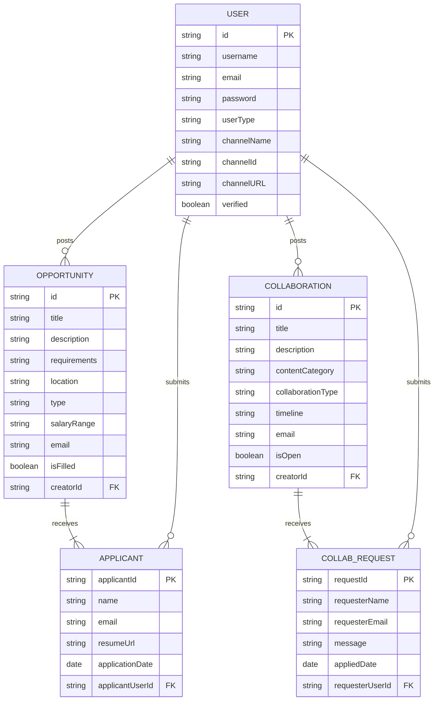

# Entity-Relationship (ER) Diagram for Wcontent

This diagram illustrates the database schema, showing the main entities and the relationships between them.

### Relationships Explained

*   **USER and OPPORTUNITY (One-to-Many):** One `USER` (specifically a "ChannelOwner") can post many `OPPORTUNITY` listings.
*   **USER and COLLABORATION (One-to-Many):** One `USER` can post many `COLLABORATION` proposals.
*   **OPPORTUNITY and APPLICANT (One-to-Many):** One `OPPORTUNITY` can receive many `APPLICANT` submissions. In the current implementation, applicants are embedded within the opportunity document.
*   **USER and APPLICANT (One-to-Many):** One `USER` (a "RoleSeeker") can submit many `APPLICANT` records (i.e., apply to many jobs).
*   **COLLABORATION and COLLAB_REQUEST (One-to-Many):** One `COLLABORATION` proposal can receive many `COLLAB_REQUEST`s.
*   **USER and COLLAB_REQUEST (One-to-Many):** One `USER` can send many `COLLAB_REQUEST`s.
