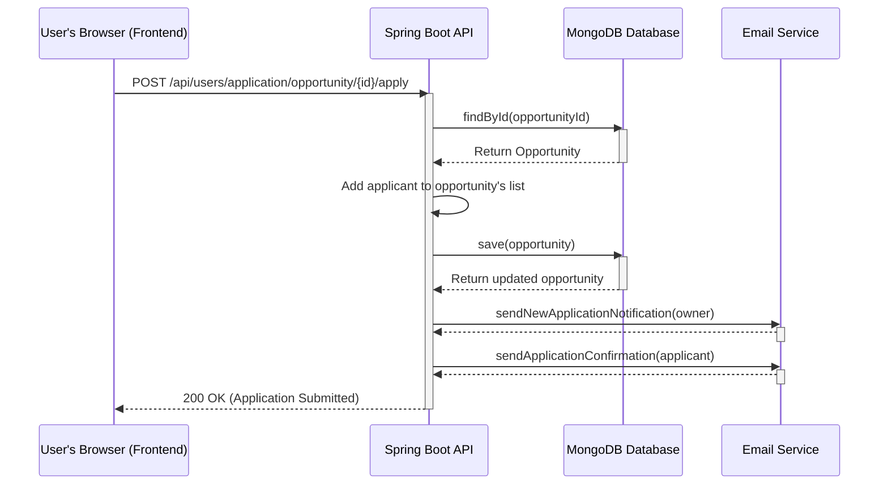
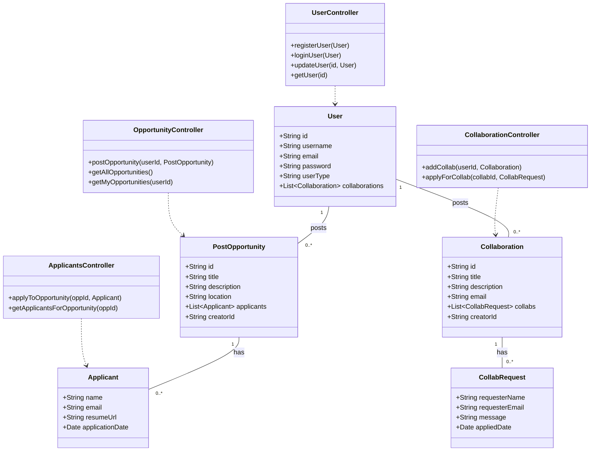

# UML Diagrams for Wcontent

This file contains key UML diagrams that model the system's behavior and structure, including Use Case, Sequence, and Class diagrams.

---

## 1. Use Case Diagram

This diagram shows the interactions between users (Actors) and the main features (Use Cases) of the Wcontent system.

```mermaid
graph TD
    subgraph "Wcontent System"
        UC1(Generate Content Ideas)
        UC2(Analyze Trends)
        UC3(Predict Performance)
        UC4(Post Opportunity)
        UC5(Browse & Apply for Opportunities)
        UC6(Post Collaboration)
        UC7(Browse & Request Collaborations)
        UC8(Manage Dashboard)
        UC9(Manage User Profile)
    end

    ActorCreator[Content Creator]
    ActorBrand[Brand / Opportunity Poster]

    ActorCreator --> UC1
    ActorCreator --> UC2
    ActorCreator --> UC3
    ActorCreator --> UC5
    ActorCreator --> UC6
    ActorCreator --> UC7
    ActorCreator --> UC8
    ActorCreator --> UC9
    
    ActorBrand --> UC4
    ActorBrand --> UC8
    ActorBrand --> UC9

    UC4 ..> UC8 : include
    UC6 ..> UC8 : include
```

---

## 2. Sequence Diagram: Applying for an Opportunity

This diagram illustrates the sequence of interactions when a user applies for an opportunity.



---

## 3. Class Diagram

This diagram shows the main classes in the backend (Java/Spring Boot) and their relationships. It provides a static view of the system's structure.


