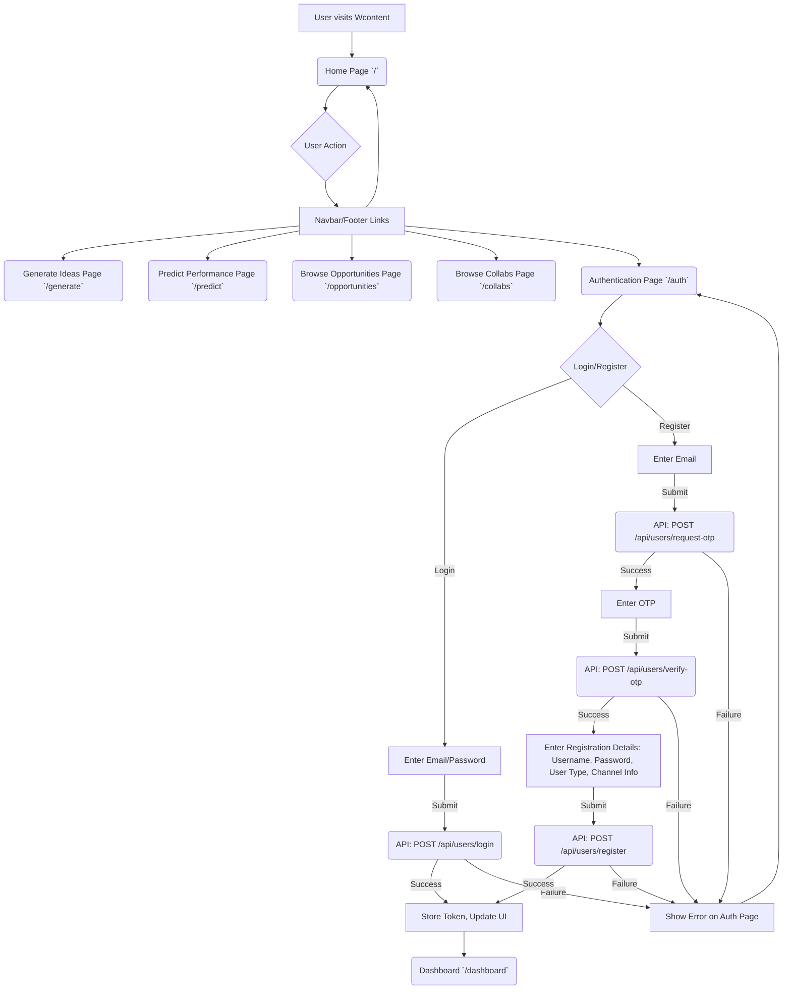

# Wcontent Website Flowchart

This flowchart outlines the main user flows and page functionalities of the Wcontent platform.

## I. Public Access & Initial Interaction



## II. Core Feature Pages (Public/Conditional Access)

### A. Generate Ideas Page (`/generate`)

```mermaid
graph TD
    subgraph Generate Ideas
        Gen1[Access /generate] --> Gen2{User Logged In?};
        Gen2 -- No --> Gen3{Free Generations Used? (>=1)};
        Gen3 -- Yes --> Gen4[Show Login Alert];
        Gen4 -- Login/Sign Up --> AuthPage1[/auth];
        Gen3 -- No --> Gen5[Display Form: Prompt, Tone, Format, Tabs (Ideas, Headlines, Outlines)];
        Gen2 -- Yes --> Gen5;

        Gen5 -- Fill Form & Submit --> Gen6(Genkit Flow: `generateContentIdeas`);
        Gen6 -- Success --> Gen7[Display Generated Content (Ideas/Headlines/Outlines)];
        Gen7 -- If Not Logged In --> Gen8[Increment Free Generation Count];
        Gen6 -- Failure --> Gen9[Show Error on Generate Page];
    end
```

### B. Predict Performance Page (`/predict`)

```mermaid
graph TD
    subgraph Predict Performance
        Pred1[Access /predict] --> Pred2{User Logged In?};
        Pred2 -- No --> Pred3{Free Predictions Used? (>=1)};
        Pred3 -- Yes --> Pred4[Show Login Alert];
        Pred4 -- Login/Sign Up --> AuthPage2[/auth];
        Pred3 -- No --> Pred5[Display: YouTube Comment Analyzer & Future Reach Predictor];
        Pred2 -- Yes --> Pred5;

        Pred5 --> Pred6{User Action};
        Pred6 -- Analyze YouTube Comments --> Pred7[Input YouTube URL];
        Pred7 -- Submit --> Pred8(API: YouTube Graph v4 API - Fetch Comments - Placeholder);
        Pred8 -- Success --> Pred9[Display Comment Summary];
        Pred9 -- If Not Logged In --> Pred10[Increment Free Prediction Count];
        Pred9 --> Pred11[Get Improvement Suggestions (Genkit - Placeholder)];
        Pred11 -- Success --> Pred12[Display Suggestions];
        Pred8 -- Failure --> Pred13[Show Error];
        Pred11 -- Failure --> Pred13;

        Pred6 -- Predict Future Reach --> Pred14[Input Content Details & Channel Stats];
        Pred14 -- Submit --> Pred15(AI: Predict Reach - Placeholder for Genkit Flow);
        Pred15 -- Success --> Pred16[Display Predicted Views, Likes, Comments, Description, Chart];
        Pred16 -- If Not Logged In --> Pred10;
        Pred16 --> Pred17[Get Improvement Tips (Genkit - Placeholder)];
        Pred17 -- Success --> Pred18[Display Tips];
        Pred15 -- Failure --> Pred13;
        Pred17 -- Failure --> Pred13;
    end
```

### C. Browse Opportunities Page (`/opportunities`)

```mermaid
graph TD
    subgraph Browse Opportunities
        Opp1[Access /opportunities] --> Opp2[Display Opportunity List, Search, Filters];
        Opp2 -- Search/Filter --> Opp2;
        Opp2 --> Opp3{User Clicks an Opportunity Card/View & Apply};

        Opp3 -- User Not Logged In --> Opp4[Show Dummy Data / Login Alert on Click];
        Opp4 -- Login/Sign Up --> AuthPage3[/auth];

        Opp3 -- User Logged In & Clicks --> Opp5[Open Opportunity Details Modal];
        Opp5 --> Opp6[Display Opportunity Details & Application Form];
        Opp6 -- Submit Application --> Opp7(API: POST /api/users/application/opportunity/{oppId}/apply);
        Opp7 -- Success --> Opp8[Show Success Message, Close Modal];
        Opp7 -- Failure --> Opp9[Show Error in Modal];

        Opp2 -- Click Opportunity (Direct Nav) --> OppDetail([Opportunity Detail Page `/opportunities/[id]`]);
        OppDetail --> Opp10[Display Full Opportunity Info];
        Opp10 --> Opp11[Placeholder: Apply Now Button];
    end
```

### D. Browse Collaborations Page (`/collabs`)

```mermaid
graph TD
    subgraph Browse Collaborations
        Col1[Access /collabs] --> Col2[Display Collaboration List, Search, Filters];
        Col2 -- Search/Filter --> Col2;
        Col2 --> Col3{User Clicks a Collab Card/View & Apply};

        Col3 -- User Not Logged In --> Col4[Show Dummy Data / Login Alert on Click];
        Col4 -- Login/Sign Up --> AuthPage4[/auth];

        Col3 -- User Logged In & Clicks --> Col5[Open Collaboration Details Modal];
        Col5 --> Col6[Display Collab Details & Application Form];
        Col6 -- Submit Application --> Col7(API: POST /api/users/collabration/applyForCollab/{collabId});
        Col7 -- Success --> Col8[Show Success Message, Close Modal];
        Col7 -- Failure --> Col9[Show Error in Modal];

        Col2 -- Click Collab (Direct Nav) --> ColDetail([Collab Detail Page `/collabs/[id]`]);
        ColDetail --> Col10[Display Full Collab Info];
        Col10 --> Col11[Placeholder: Request Collaboration Button];
    end
```

## III. Authenticated Dashboard (`/dashboard/*`)

*(User must be logged in to access these pages. If not, redirect to `/auth`)*

```mermaid
graph TD
    subgraph Dashboard General
        DashStart[User Navigates to any /dashboard/* route] --> DashAuthCheck{Logged In?};
        DashAuthCheck -- No --> AuthRedirect[/auth];
        DashAuthCheck -- Yes --> DashboardLayout[Display Dashboard Layout (Sidebar + Main Content)];
    end

    subgraph Dashboard Sidebar Navigation
        DashboardLayout --> Sidebar[Dashboard Sidebar];
        Sidebar --> NavProfile[My Profile `/dashboard`];
        Sidebar --> NavUpdateProfile[Update Profile `/dashboard/update`];
        Sidebar --> NavPostOpp[Post Opportunity `/dashboard/opportunities/new`];
        Sidebar --> NavMyOpps[My Opportunities `/dashboard/opportunities/myopportunities`];
        Sidebar --> NavMyAppsOpp[My Applications (Opps) `/dashboard/opportunities/myapps`];
        Sidebar --> NavPostCollab[Post Collab `/dashboard/collabs/new`];
        Sidebar --> NavMyCollabs[My Collabs `/dashboard/collabs/myrequests`];
        Sidebar --> NavGenerateIdeas2[Generate Ideas `/generate`];
        Sidebar --> NavBrowseOpps2[Browse Opportunities `/opportunities`];
        Sidebar --> NavBrowseCollabs2[Browse Collabs `/collabs`];
        Sidebar --> LogoutBtn[Logout Button];
        LogoutBtn -- Click --> LogoutConfirm{Confirm Logout?};
        LogoutConfirm -- Yes --> LogoutAction[Clear Token, Redirect to /auth];
        LogoutConfirm -- No --> Sidebar;
    end

    subgraph Dashboard Pages
        NavProfile --> ProfilePage[My Profile Page];
        ProfilePage -- Fetch Data --> API_GetUser1(API: GET /api/users/getUser/{userId});
        API_GetUser1 -- Success --> ProfilePageDisplay[Display User Info];
        ProfilePage --> EditProfileBtn[Edit Profile Button];
        EditProfileBtn --> NavUpdateProfile;

        NavUpdateProfile --> UpdateProfilePage[Update Profile Page];
        UpdateProfilePage -- Fetch Initial Data --> API_GetUser2(API: GET /api/users/getUser/{userId});
        UpdateProfilePage -- Fill Form & Submit --> API_UpdateUser(API: PUT /api/users/update/{userId});
        API_UpdateUser -- Success --> ShowSuccessMsg1[Show Success Message];
        API_UpdateUser -- Failure --> ShowErrorMsg1[Show Error Message];

        NavPostOpp --> PostOppPage[Post New Opportunity Page];
        PostOppPage -- Fill Form & Submit --> API_PostOpp(API: POST /api/users/opportunities/opportunity/{userId});
        API_PostOpp -- Success --> ShowSuccessMsg2[Show Success Message, Reset Form];
        API_PostOpp -- Failure --> ShowErrorMsg2[Show Error Message];

        NavMyOpps --> MyOppsPage[My Opportunities Page];
        MyOppsPage -- Fetch Data --> API_GetMyOpps(API: GET /api/users/opportunities/getMyOpportunities/{userId});
        API_GetMyOpps -- Success --> MyOppsList[Display List of User's Opportunities];
        MyOppsList -- No Opps --> ShowNoOpps[Display "No opportunities posted", Add One Button --> NavPostOpp];
        MyOppsList -- Click "View Applications" on an Opp --> MyOppsModal[Open Applications Modal];
        MyOppsModal -- Fetch Apps --> API_GetOppApps(API: GET /api/users/application/opportunity/{oppId}/applicants);
        API_GetOppApps -- Success --> DisplayAppList1[Display List of Applicants in Modal];
        API_GetOppApps -- Failure --> ShowErrorInModal1[Show Error in Modal];

        NavMyAppsOpp --> MyAppsOppPage[My Applications (Opportunities) Page];
        MyAppsOppPage -- Fetch Data --> API_GetMyAppsOpp(API: GET /api/users/application/myApplications/{userId});
        API_GetMyAppsOpp -- Success --> MyAppsOppList[Display List of Applied Opportunities];
        MyAppsOppList -- No Apps --> ShowNoMyAppsOpp[Display "No applications yet", Browse Button --> NavBrowseOpps2];

        NavPostCollab --> PostCollabPage[Post New Collab Page];
        PostCollabPage -- Fill Form & Submit --> API_PostCollab(API: POST /api/users/collabration/addCollab/{userId});
        API_PostCollab -- Success --> ShowSuccessMsg3[Show Success Message, Reset Form];
        API_PostCollab -- Failure --> ShowErrorMsg3[Show Error Message];

        NavMyCollabs --> MyCollabsPage[My Collaborations Page];
        MyCollabsPage -- Fetch Data --> API_GetMyCollabs(API: GET /api/users/collabration/getCollabOfUser/{userId});
        API_GetMyCollabs -- Success --> MyCollabsList[Display List of User's Collabs];
        MyCollabsList -- No Collabs --> ShowNoCollabs[Display "No collabs posted", Add One Button --> NavPostCollab];
        MyCollabsList -- Click "View Requests" on a Collab --> MyCollabsModal[Open Requests Modal];
        MyCollabsModal -- Fetch Requests --> API_GetCollabReqs(API: GET /api/users/collabration/getCollabRequests/{collabId});
        API_GetCollabReqs -- Success --> DisplayReqList[Display List of Requesters in Modal];
        API_GetCollabReqs -- Failure --> ShowErrorInModal2[Show Error in Modal];
    end
```

**Notes:**

*   This flowchart provides a high-level overview. Each page can have more detailed internal logic.
*   "API:" denotes an interaction with the Spring Boot backend.
*   "Genkit Flow:" denotes an interaction with the AI/Genkit layer.
*   Error handling is simplified; actual implementations would involve more specific error messages and user feedback.
*   The YouTube Graph API v4 usage for comment analysis is noted but the exact flow for fetching and processing is abstracted.
*   Placeholder functionalities (like "Apply Now (TBD)") are indicated.
*   This assumes the backend API endpoints match those inferred from the frontend code and previous discussions.

This should provide a good visual representation of the Wcontent project for your presentation.
